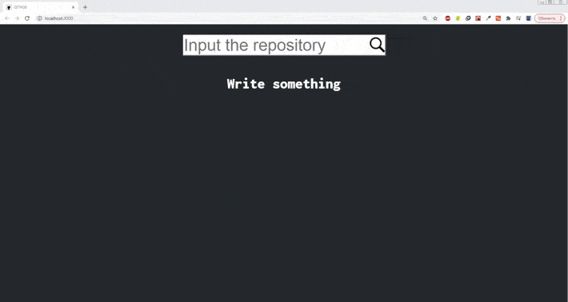

# WEBSITE FOR SEARCHING GIT REPOSITORIES

## INSTALLATION:

### `npm install`

## RUN SERVER

### `npm start`

## DEPENDENCIES:

    "@testing-library/jest-dom": "^5.11.9",
    "@testing-library/react": "^11.2.5",
    "@testing-library/user-event": "^12.8.3",
    "react": "^17.0.1",
    "react-dom": "^17.0.1",
    "react-redux": "^7.2.2",
    "react-scripts": "4.0.3",
    "redux": "^4.0.5",
    "redux-devtools-extension": "^2.13.9",
    "redux-saga": "^1.1.3",
    "web-vitals": "^1.1.0"

###### P.S 
In the next project i will use Eslint, change .png images to svg(if it will possible) to lighten the website, give better names for variables, and continue using react :)

